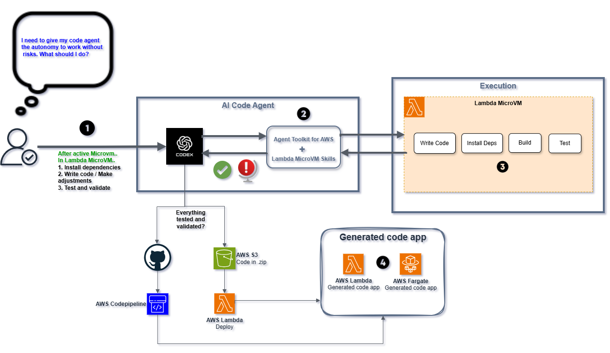

# lambda-microvm-codevalidator


Imagine um projeto extremamente crítico, com milhares ou milhões de usuários, em que você não quer “sujar” o ambiente local nem o
ambiente principal de desenvolvimento na AWS para testar uma nova feature, correção ou tarefa exploratória com um agente de código. Nesse cenário, a MicroVM entra
como um sandbox operacional: o agente recebe autonomia para trabalhar, testar e validar em um ambiente isolado, reduzindo risco sobre o restante da stack. A PoC
existe justamente para mostrar como AWS Lambda MicroVM pode servir como essa camada de isolamento, enquanto o S3 e a Lambda deployer fazem a ponte entre o artefato
validado e a atualização controlada da aplicação.

A proposta é usar AWS Lambda MicroVM como ambiente isolado para o Codex produzir, ajustar, testar e validar código com mais segurança operacional, sem depender diretamente do ambiente
local do usuário e com melhor separação entre execução, experimentação e promoção de artefatos.

Aqui conectamos três partes em um fluxo único. A primeira é a MicroVM, que funciona como workspace isolado para geração e validação técnica. A segunda é a
aplicação Lambda alvo, que representa o código que o agente está construindo ou atualizando. A terceira é o mecanismo de promoção automática, em que um novo .zip
publicado no S3 dispara uma Lambda deployer, responsável por atualizar o código da Lambda principal. Em resumo, a PoC foi pensada para demonstrar um caminho de
geração de código assistida por agente, validação em ambiente isolado e implantação posterior de forma automatizada e rastreável.





Este documento registra o fluxo de comandos usado na PoC, desde:

- criação do bucket S3;
- criação da role usada no build da imagem;
- empacotamento da estrutura `Dockerfile`, `app.py` e start.sh;
- criação da imagem da MicroVM;
- execução da MicroVM com a imagem criada.

Os nomes abaixo foram atualizados com os recursos efetivamente usados no
fluxo mais recente de teste.

## Variáveis usadas

```bash
AWS_REGION="us-east-1"
ACCOUNT_ID=""
ARTIFACT_BUCKET="microvm-codevalidator-poc-${ACCOUNT_ID}"
IMAGE_NAME="poc-microvm-docker-fixed2"
IMAGE_VERSION="1.0"
BASE_IMAGE_ARN="arn:aws:lambda:us-east-1:aws:microvm-image:al2023-1"
BUILD_ROLE_NAME="microvm-codevalidator-poc-build-role"
BUILD_ROLE_ARN="arn:aws:iam::${ACCOUNT_ID}:role/${BUILD_ROLE_NAME}"
IMAGE_ARN="arn:aws:lambda:${AWS_REGION}:${ACCOUNT_ID}:microvm-image:${IMAGE_NAME}"
CURRENT_MICROVM_ID="microvm-9235b24a-c812-3b6f-a9b3-85e31669e012"
```

## 1. Conferência inicial

```bash
aws configure get region
aws sts get-caller-identity
aws lambda-microvms list-managed-microvm-images
```

## 2. Criação do bucket S3

Para `us-east-1`:

```bash
aws s3api create-bucket \
  --bucket "${ARTIFACT_BUCKET}" \
  --region "${AWS_REGION}"
```


Para outras regiões, normalmente seria necessário incluir
`--create-bucket-configuration`.

## 3. Criação da role de build da imagem

Neste fluxo documentado, existe apenas a criação da role de build. Não
há uma etapa separada de criação de outra role neste documento.

Trust policy:

```bash
cat > trust-policy.json <<'EOF'
{
  "Version": "2012-10-17",
  "Statement": [{
    "Effect": "Allow",
    "Principal": { "Service": "lambda.amazonaws.com" },
    "Action": ["sts:AssumeRole", "sts:TagSession"]
  }]
}
EOF
```

Criação da role:

```bash
aws iam create-role \
  --role-name "${BUILD_ROLE_NAME}" \
  --assume-role-policy-document file://trust-policy.json
```

Policy mínima de exemplo para o build:

```bash
cat > build-role-policy.json <<'EOF'
{
    "Version": "2012-10-17",
    "Statement": [
        {
            "Effect": "Allow",
            "Action": [
                "s3:GetBucketLocation",
                "s3:ListBucket"
            ],
            "Resource": "*"
        },
        {
            "Effect": "Allow",
            "Action": [
                "s3:GetObject",
                "s3:GetObjectVersion"
            ],
            "Resource": "*"
        },
        {
            "Effect": "Allow",
            "Action": [
                "logs:CreateLogGroup",
                "logs:CreateLogStream",
                "logs:PutLogEvents"
            ],
            "Resource": "*"
        },
        {
            "Effect": "Allow",
            "Action": "bedrock:*",
            "Resource": "*"
        }
    ]
}
EOF
```

Anexando a policy inline:

```bash
aws iam put-role-policy \
  --role-name "${BUILD_ROLE_NAME}" \
  --policy-name "microvm-codevalidator-poc-build-policy" \
  --policy-document file://build-role-policy.json
```

## 4. Estrutura do artefato da imagem

Estrutura esperada do zip:

```text
code-artifact.zip
├── Dockerfile
├── app.py

```

Exemplo de empacotamento:

```bash
zip "${IMAGE_NAME}.zip" Dockerfile app.py 
```

Upload do artefato:

```bash
aws s3 cp "${IMAGE_NAME}.zip" \
  "s3://${ARTIFACT_BUCKET}/microvm-images/${IMAGE_NAME}/code-artifact.zip"
```

## 5. Criação da imagem da MicroVM

```bash
aws lambda-microvms create-microvm-image \
  --name "${IMAGE_NAME}" \
  --base-image-arn "${BASE_IMAGE_ARN}" \
  --build-role-arn "${BUILD_ROLE_ARN}" \
  --code-artifact "{\"uri\":\"s3://${ARTIFACT_BUCKET}/microvm-images/${IMAGE_NAME}/code-artifact.zip\"}"
```

## 6. Acompanhamento da criação da imagem

Consulta da imagem:

```bash
aws lambda-microvms get-microvm-image \
  --image-identifier "${IMAGE_ARN}"
```

Consulta dos builds:

```bash
aws lambda-microvms list-microvm-image-builds \
  --image-identifier "${IMAGE_ARN}" \
  --image-version "${IMAGE_VERSION}"
```

## 7. Execução da MicroVM usando a imagem criada

```bash
aws lambda-microvms run-microvm \
  --image-identifier "${IMAGE_ARN}" \
  --image-version "${IMAGE_VERSION}" \
  --execution-role-arn "${BUILD_ROLE_ARN}" \
  --ingress-network-connectors '[
    "arn:aws:lambda:us-east-1:aws:network-connector:aws-network-connector:HTTP_INGRESS",
    "arn:aws:lambda:us-east-1:aws:network-connector:aws-network-connector:SHELL_INGRESS"
  ]' \
  --egress-network-connectors '[
    "arn:aws:lambda:us-east-1:aws:network-connector:aws-network-connector:INTERNET_EGRESS"
  ]' \
  --idle-policy '{
    "maxIdleDurationSeconds": 900,
    "suspendedDurationSeconds": 7200,
    "autoResumeEnabled": true
  }' \
  --maximum-duration-in-seconds 28800
```

## 8. Conferência da MicroVM criada

```bash
aws lambda-microvms get-microvm \
  --microvm-identifier "${CURRENT_MICROVM_ID}"
```

## 9. Passo seguinte comum

Se a MicroVM for criada com `SHELL_INGRESS`, o próximo passo costuma ser:

```bash
aws lambda-microvms create-microvm-shell-auth-token \
  --microvm-identifier "${CURRENT_MICROVM_ID}" \
  --expiration-in-minutes 30
```

Depois disso, a conexão costuma ser feita com `websocat` usando a porta
`8022`.

## Instalar Lambda MicroVM Skill

### Pré requisitos

```
node -v
npm -v
npx --version
uvx --version
codex --version
aws --version

```

### Comando

```
npx skills add https://github.com/aws/agent-toolkit-for-aws/tree/main/skills/specialized-skills/serverless-skills/aws-lambda-microvms --yes --global

```


## Prompt exemplo usando Agente de codigo + Lambda MicroVM Skills

```
Utilize a skill aws-lambda-microvms.

  Pegue o código local deste repositório como base e trabalhe com autonomia somente para geração, alteração, instalação de dependências e testes do código dentro de
  uma AWS Lambda MicroVM isolada.

  Objetivo:
  - analisar o código atual;
  - implementar a feature solicitada;
  - instalar dependências novas, se necessário;
  - atualizar testes e arquivos de configuração relacionados;
  - executar lint, testes unitários, testes de integração/local runtime e demais validações técnicas necessárias;
  - corrigir automaticamente o que falhar durante esse ciclo;
  - repetir o processo até o código ficar validado dentro da MicroVM.

  Limites de autonomia:
  - você tem autonomia para gerar, alterar, instalar dependências e testar o código;
  - você não tem autonomia para enviar artefatos para S3;
  - você não tem autonomia para promover deploy;
  - você não deve fazer commit, push ou alterar infraestrutura sem aprovação humana;
  - se o código for validado com sucesso na MicroVM, pare e me peça aprovação explícita antes de empacotar para envio ao S3 ou iniciar qualquer etapa de publicação.

  Ao final da validação na MicroVM, me entregue:
  - resumo do que foi alterado;
  - dependências instaladas;
  - comandos executados;
  - resultado dos testes e validações;
  - status final da validação;
  - se estiver tudo certo, um pedido claro de aprovação humana para seguir com empacotamento e envio ao S3.

  Feature a implementar:
  <descreva aqui a feature>

  Restrições:
  - use o código local atual como fonte da verdade;
  - preserve o que já funciona;
  - não publique nada sem aprovação humana explícita;
  - se houver bloqueio de ambiente, informe exatamente o erro, o impacto e o que depende de aprovação.

```

## Complemento da PoC

Além da criação e uso da Lambda MicroVM, a estrutura deste repositório foi
orientada para dar autonomia ao Codex com `aws-lambda-microvms` skills no
ciclo de geração, ajuste, validação e preparação de deploy de código.

Também foi criada uma estrutura Terraform complementar para o fluxo de
implantação:

- bucket S3: `microvm-codevalidator-poc-275573050667`
- Lambda principal: `webscraping-bedrock-app`
- Lambda de deploy: `webscraping-bedrock-deployer`

Nesse fluxo, um novo arquivo `.zip` enviado ao bucket S3 dispara a Lambda
`webscraping-bedrock-deployer`, que executa o `UpdateFunctionCode` da Lambda
`webscraping-bedrock-app`. A ideia central da PoC foi cobrir não só geração ou
atualização de código, mas também o passo seguinte de promoção do pacote para
o ambiente produtivo.
